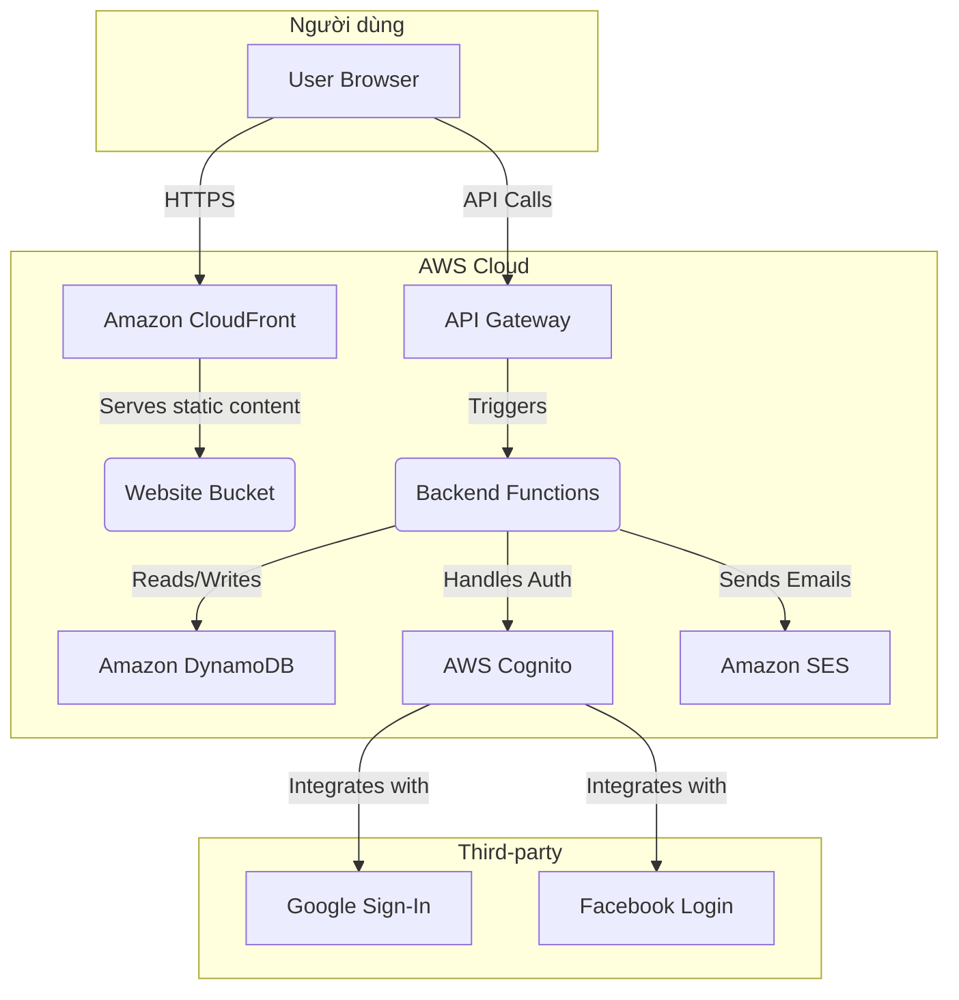
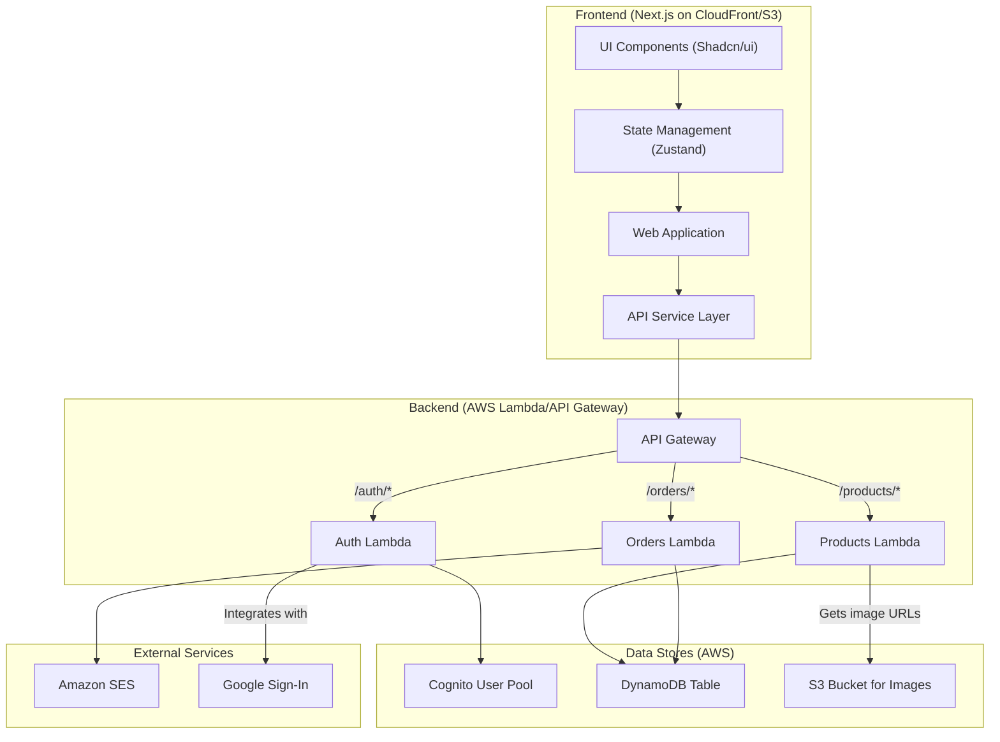
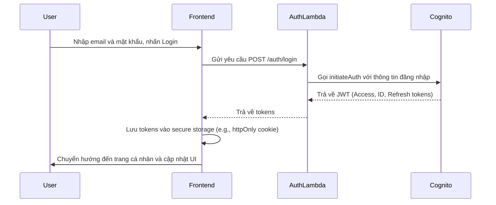
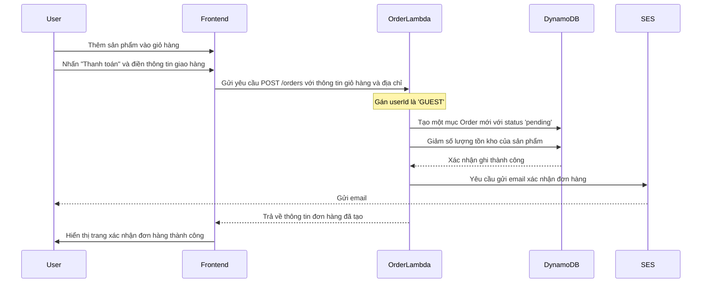
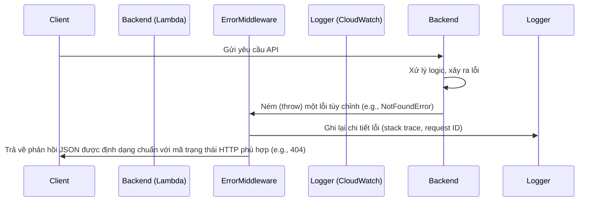

# Tài liệu Kiến trúc Fullstack cho 18th Perfume

## **Introduction**

This document outlines the complete fullstack architecture for 18th Perfume, including backend systems, frontend implementation, and their integration. It serves as the single source of truth for AI-driven development, ensuring consistency across the entire technology stack.

This unified approach combines what would traditionally be separate backend and frontend architecture documents, streamlining the development process for modern fullstack applications where these concerns are increasingly intertwined.

## **Change Log**

| Date | Version | Description | Author |
| :--- | :--- | :--- | :--- |
| 2024-07-27 | 1.0 | Initial draft | Winston |

## **High Level Architecture**

### Technical Summary

Kiến trúc cho 18th Perfume được thiết kế theo phương pháp tiếp cận "serverless-first" và Jamstack, tận dụng các dịch vụ được quản lý của AWS để đạt được khả năng mở rộng, hiệu suất và chi phí vận hành thấp. Giao diện người dùng (frontend) sẽ là một ứng dụng Next.js được tạo tĩnh (statically-generated), cung cấp trải nghiệm người dùng nhanh chóng và được phân phối toàn cầu qua Amazon CloudFront. Phần phụ trợ (backend) sẽ được xây dựng trên AWS Lambda và API Gateway, cung cấp các API RESTful an toàn và có khả năng mở rộng. Tích hợp giữa hai phần sẽ thông qua các lệnh gọi API được định nghĩa rõ ràng, với AWS Cognito quản lý xác thực người dùng. Kiến trúc này trực tiếp giải quyết các yêu cầu trong PRD về hiệu suất, khả năng mở rộng linh hoạt và bảo mật mạnh mẽ.

### Platform and Infrastructure Choice

**Platform:** AWS (Amazon Web Services)
**Key Services:** AWS Lambda, API Gateway, Amazon S3, Amazon CloudFront, Amazon DynamoDB, AWS Cognito, Amazon SES.
**Deployment Host and Regions:** ap-southeast-1 (Singapore)

### Repository Structure

**Structure:** Polyrepo
**Monorepo Tool:** N/A
**Package Organization:**
Sẽ có hai kho lưu trữ (repository) riêng biệt:
1.  `18thperfume-frontend`: Chứa ứng dụng Next.js.
2.  `18thperfume-backend`: Chứa các dịch vụ backend serverless (AWS Lambda, Serverless Framework).

Lý do chọn Polyrepo là để cho phép các nhóm frontend và backend phát triển và triển khai độc lập, giảm độ phức tạp trong pipeline CI/CD cho từng phần.

### High Level Architecture Diagram



#### Architectural Patterns

- **Serverless-First:** Ưu tiên sử dụng các dịch vụ serverless của AWS (Lambda, DynamoDB, S3) để giảm thiểu chi phí vận hành, tự động mở rộng và tập trung vào việc viết mã logic nghiệp vụ thay vì quản lý cơ sở hạ tầng.
- **Jamstack:** Frontend được xây dựng dưới dạng các tệp tĩnh (HTML, CSS, JS) được tạo sẵn và phân phối qua CDN. Các chức năng động được xử lý thông qua các API có thể tái sử dụng. Điều này mang lại hiệu suất cao, bảo mật tốt hơn và trải nghiệm phát triển mượt mà.
- **Polyrepo:** Tách biệt mã nguồn frontend và backend thành các kho lưu trữ riêng biệt để cho phép các nhóm phát triển và triển khai độc lập.
- **Single-Table Design (DynamoDB):** Sử dụng một bảng duy nhất trong DynamoDB để lưu trữ tất cả các loại thực thể dữ liệu, tối ưu hóa cho các truy vấn hiệu suất cao bằng cách giảm thiểu số lượng yêu cầu đọc/ghi.
- **API Gateway Pattern:** Sử dụng AWS API Gateway làm một cổng vào duy nhất cho tất cả các yêu cầu từ client, giúp tập trung hóa việc xác thực, giới hạn tốc độ (rate limiting) và giám sát.
- **Component-Based UI:** Xây dựng giao diện người dùng từ các thành phần React có thể tái sử dụng, độc lập và được quản lý bằng Storybook, giúp tăng tính nhất quán và khả năng bảo trì.
- **Infrastructure as Code (IaC):** Sử dụng Serverless Framework để định nghĩa và quản lý tài nguyên cơ sở hạ tầng backend, đảm bảo tính nhất quán giữa các môi trường và tự động hóa việc triển khai.

## Tech Stack

| Category | Technology | Version | Purpose | Rationale |
| :--- | :--- | :--- | :--- | :--- |
| Frontend Language | TypeScript | ~5.3.3 | Ngôn ngữ chính cho phát triển frontend | Cung cấp type-safety, cải thiện chất lượng mã nguồn và trải nghiệm lập trình viên. |
| Frontend Framework | Next.js | ~14.1.0 | Framework xây dựng giao diện người dùng | Tối ưu hóa cho hiệu suất (SSR, SSG), SEO-friendly, và hệ sinh thái mạnh mẽ. |
| UI Component Library | Shadcn/ui | ~0.8.0 | Thư viện các thành phần UI có thể tái sử dụng | Cung cấp các khối xây dựng UI đẹp, dễ tùy chỉnh và dễ tiếp cận. |
| State Management | Zustand | ~4.5.2 | Quản lý trạng thái global của ứng dụng | Nhẹ, đơn giản, dễ sử dụng và ít boilerplate hơn so với Redux. |
| Backend Language | TypeScript | ~5.3.3 | Ngôn ngữ chính cho phát triển backend | Nhất quán với frontend, cung cấp type-safety cho các hàm Lambda. |
| Backend Framework | Node.js | 20.x | Môi trường thực thi cho backend | Hiệu suất cao cho các tác vụ I/O, hệ sinh thái npm lớn. |
| API Style | REST | OpenAPI 3.0 | Định dạng giao tiếp giữa frontend và backend | Tiêu chuẩn ngành, được hỗ trợ rộng rãi và dễ hiểu. |
| Database | Amazon DynamoDB | On-demand | Cơ sở dữ liệu NoSQL chính | Khả năng mở rộng vô hạn, hiệu suất cao, phù hợp với mô hình serverless. |
| File Storage | Amazon S3 | Standard | Lưu trữ ảnh sản phẩm và các tệp tĩnh khác | Bền bỉ, chi phí thấp, tích hợp tốt với CloudFront để phân phối nội dung. |
| Authentication | AWS Cognito | Serverless | Quản lý người dùng và xác thực | Dịch vụ được quản lý hoàn toàn, hỗ trợ social login, an toàn và có khả năng mở rộng. |
| Frontend Testing | Jest & React Testing Library | latest | Unit & integration testing cho các component React | Tiêu chuẩn cho việc kiểm thử ứng dụng React, tập trung vào hành vi người dùng. |
| Backend Testing | Jest & Supertest | latest | Unit & integration testing cho các hàm Lambda | Kết hợp Jest cho unit test và Supertest để kiểm thử API endpoints. |
| E2E Testing | Cypress | latest | Kiểm thử đầu cuối toàn bộ ứng dụng | Cung cấp trải nghiệm gỡ lỗi tốt và kiểm thử đáng tin cậy trên trình duyệt. |
| IaC Tool | Serverless Framework | ~3.38.0 | Định nghĩa và triển khai cơ sở hạ tầng backend | Đơn giản hóa việc triển khai ứng dụng serverless trên AWS. |
| CI/CD | GitHub Actions | v4 | Tự động hóa build, test và deploy | Tích hợp sẵn với GitHub, dễ dàng cấu hình các quy trình làm việc. |
| CSS Framework | Tailwind CSS | ~3.4.1 | Framework CSS utility-first | Cho phép tạo kiểu nhanh chóng và nhất quán mà không cần rời khỏi HTML. |

## Data Models

### Product

**Purpose:** Đại diện cho một sản phẩm nước hoa trong cửa hàng.

**Key Attributes:**
- `PK`: `PRODUCT#<product_id>` - Khóa chính
- `SK`: `METADATA#<product_id>` - Khóa sắp xếp
- `productId`: string - ID duy nhất của sản phẩm
- `name`: string - Tên sản phẩm
- `description`: string - Mô tả chi tiết
- `brand`: string - Thương hiệu
- `category`: string - Danh mục (e.g., 'Nam', 'Nữ', 'Unisex')
- `tags`: string[] - Các thẻ để tìm kiếm
- `createdAt`: string (ISO 8601) - Ngày tạo
- `updatedAt`: string (ISO 8601) - Ngày cập nhật cuối

#### TypeScript Interface
```typescript
interface Product {
  productId: string;
  name: string;
  description: string;
  brand: string;
  category: string;
  tags: string[];
  variants: ProductVariant[]; // Denormalized for quick access
  createdAt: string;
  updatedAt: string;
}
```

#### Relationships
- Một `Product` có nhiều `ProductVariant`.

### ProductVariant

**Purpose:** Đại diện cho một biến thể cụ thể của sản phẩm (ví dụ: dung tích khác nhau).

**Key Attributes:**
- `PK`: `PRODUCT#<product_id>` - Khóa chính (cùng PK với Product)
- `SK`: `VARIANT#<variant_id>` - Khóa sắp xếp
- `variantId`: string - ID duy nhất của biến thể
- `productId`: string - ID của sản phẩm cha
- `size`: string - Dung tích (e.g., '50ml', '100ml')
- `price`: number - Giá bán
- `stock`: number - Số lượng tồn kho
- `imageUrl`: string - URL hình ảnh cho biến thể này

#### TypeScript Interface
```typescript
interface ProductVariant {
  variantId: string;
  productId: string;
  size: string;
  price: number;
  stock: number;
  imageUrl: string;
}
```

#### Relationships
- Thuộc về một `Product`.

### Order

**Purpose:** Đại diện cho một đơn hàng của khách hàng.

**Key Attributes:**
- `PK`: `USER#<user_id>` - Khóa chính
- `SK`: `ORDER#<order_id>` - Khóa sắp xếp
- `orderId`: string - ID duy nhất của đơn hàng
- `userId`: string - ID của người dùng đặt hàng (hoặc 'GUEST')
- `items`: OrderItem[] - Danh sách các sản phẩm trong đơn hàng
- `totalAmount`: number - Tổng giá trị đơn hàng
- `status`: 'pending' | 'paid' | 'shipped' | 'delivered' | 'cancelled' - Trạng thái đơn hàng
- `shippingAddress`: object - Địa chỉ giao hàng
- `createdAt`: string (ISO 8601) - Ngày tạo

#### TypeScript Interface
```typescript
interface OrderItem {
  variantId: string;
  productId: string;
  quantity: number;
  price: number; // Price at time of purchase
}

interface Order {
  orderId: string;
  userId: string;
  items: OrderItem[];
  totalAmount: number;
  status: 'pending' | 'paid' | 'shipped' | 'delivered' | 'cancelled';
  shippingAddress: {
    recipientName: string;
    phone: string;
    address: string;
    city: string;
  };
  createdAt: string;
}
```

#### Relationships
- Một `Order` thuộc về một `User` (hoặc là đơn hàng của khách vãng lai).
- Một `Order` chứa nhiều `OrderItem`.

### User

**Purpose:** Đại diện cho một tài khoản người dùng.

**Key Attributes:**
- `PK`: `USER#<user_id>` - Khóa chính
- `SK`: `METADATA#<user_id>` - Khóa sắp xếp
- `userId`: string - ID duy nhất (thường là sub từ Cognito)
- `email`: string - Địa chỉ email
- `name`: string - Tên người dùng
- `authProvider`: 'cognito' | 'google' | 'facebook' - Nhà cung cấp xác thực
- `createdAt`: string (ISO 8601) - Ngày tạo

#### TypeScript Interface
```typescript
interface User {
  userId: string;
  email: string;
  name: string;
  authProvider: 'cognito' | 'google' | 'facebook';
  createdAt: string;
}
```

#### Relationships
- Một `User` có thể có nhiều `Order`.

## API Specification

### REST API Specification (OpenAPI 3.0)

```yaml
openapi: 3.0.0
info:
  title: 18th Perfume API
  version: v1
  description: API for the 18th Perfume e-commerce platform.
servers:
  - url: /api/v1
    description: API Gateway base path
paths:
  /products:
    get:
      summary: Lấy danh sách sản phẩm
      parameters:
        - name: category
          in: query
          schema:
            type: string
        - name: limit
          in: query
          schema:
            type: integer
            default: 20
      responses:
        '200':
          description: Danh sách sản phẩm.
          content:
            application/json:
              schema:
                type: array
                items:
                  $ref: '#/components/schemas/Product'
  /products/{productId}:
    get:
      summary: Lấy chi tiết sản phẩm
      parameters:
        - name: productId
          in: path
          required: true
          schema:
            type: string
      responses:
        '200':
          description: Chi tiết sản phẩm.
          content:
            application/json:
              schema:
                $ref: '#/components/schemas/Product'
        '404':
          description: Không tìm thấy sản phẩm.
  /cart:
    post:
      summary: Tạo giỏ hàng hoặc thêm sản phẩm vào giỏ hàng
      requestBody:
        required: true
        content:
          application/json:
            schema:
              type: object
              properties:
                variantId:
                  type: string
                quantity:
                  type: integer
      responses:
        '200':
          description: Cập nhật giỏ hàng thành công.
  /orders:
    post:
      summary: Tạo đơn hàng mới (checkout)
      security:
        - bearerAuth: []
      requestBody:
        required: true
        content:
          application/json:
            schema:
              $ref: '#/components/schemas/OrderInput'
      responses:
        '201':
          description: Tạo đơn hàng thành công.
          content:
            application/json:
              schema:
                $ref: '#/components/schemas/Order'
  /auth/register:
    post:
      summary: Đăng ký người dùng mới
      requestBody:
        #...
  /auth/login:
    post:
      summary: Đăng nhập
      requestBody:
        #...
components:
  securitySchemes:
    bearerAuth:
      type: http
      scheme: bearer
      bearerFormat: JWT
  schemas:
    Product:
      #... định nghĩa schema dựa trên interface Product
    Order:
      #... định nghĩa schema dựa trên interface Order
    OrderInput:
      #... định nghĩa schema cho việc tạo đơn hàng
```

## Components

### Component Diagram



### Component List

#### Frontend: Web Application
- **Responsibility:** Cung cấp giao diện người dùng, xử lý tương tác và hiển thị dữ liệu.
- **Key Interfaces:** Tương tác với `API Service Layer` để lấy và gửi dữ liệu.
- **Dependencies:** `API Service Layer`, `State Management`.
- **Technology Stack:** Next.js, React, TypeScript.

#### Backend: Products Lambda
- **Responsibility:** Xử lý tất cả logic nghiệp vụ liên quan đến sản phẩm (lấy danh sách, chi tiết, tìm kiếm).
- **Key Interfaces:** Các endpoint API `/products` và `/products/{id}`.
- **Dependencies:** `DynamoDB`.
- **Technology Stack:** Node.js, TypeScript, Serverless Framework.

#### Backend: Orders Lambda
- **Responsibility:** Xử lý logic tạo và quản lý đơn hàng, bao gồm cả quy trình thanh toán (giả định).
- **Key Interfaces:** Endpoint API `/orders`.
- **Dependencies:** `DynamoDB`, `Amazon SES` (để gửi email xác nhận).
- **Technology Stack:** Node.js, TypeScript, Serverless Framework.

#### Backend: Auth Lambda
- **Responsibility:** Xử lý đăng ký, đăng nhập và các hoạt động liên quan đến xác thực người dùng.
- **Key Interfaces:** Các endpoint API `/auth/*`.
- **Dependencies:** `AWS Cognito`.
- **Technology Stack:** Node.js, TypeScript, Serverless Framework.

## Core Workflows

### User Authentication Flow (Login)



### Guest Checkout Flow



## Database Schema (DynamoDB Single-Table Design)

Sử dụng một bảng duy nhất với các mẫu truy cập được xác định trước.

**Table Name:** `18thPerfumeTable`

**Key Schema:**
- **Partition Key (PK):** `PK` (string)
- **Sort Key (SK):** `SK` (string)

**Global Secondary Indexes (GSIs):**
- **GSI1:**
    - **GSI1PK:** `GSI1PK` (string)
    - **GSI1SK:** `GSI1SK` (string)
    - **Purpose:** Dùng để truy vấn các mục theo loại (ví dụ: lấy tất cả sản phẩm).

**Data Items Examples:**

| PK | SK | GSI1PK | GSI1SK | Data |
| :--- | :--- | :--- | :--- | :--- |
| `USER#user123` | `METADATA#user123` | | | `{ "email": "...", "name": "..." }` |
| `USER#user123` | `ORDER#order456` | | | `{ "totalAmount": 500, "status": "paid", ... }` |
| `PRODUCT#prod789` | `METADATA#prod789` | `PRODUCT` | `2024-07-27T10:00:00Z#prod789` | `{ "name": "...", "brand": "...", "category": "Unisex" }` |
| `PRODUCT#prod789` | `VARIANT#varABC` | | | `{ "size": "100ml", "price": 500, "stock": 10 }` |
| `PRODUCT#prod789` | `VARIANT#varDEF` | | | `{ "size": "50ml", "price": 300, "stock": 25 }` |

**Access Patterns:**
- **Lấy thông tin người dùng và tất cả đơn hàng của họ:** `Query(PK = "USER#user123")`
- **Lấy chi tiết sản phẩm và tất cả biến thể của nó:** `Query(PK = "PRODUCT#prod789")`
- **Lấy tất cả sản phẩm (có thể phân trang):** `Query(GSI1PK = "PRODUCT")`

## Frontend Architecture

### Component Architecture

#### Component Organization
```
src/
└── components/
    ├── ui/
    │   ├── button.tsx      # Re-exported from Shadcn
    │   └── card.tsx        # Re-exported from Shadcn
    ├── common/
    │   ├── header.tsx
    │   ├── footer.tsx
    │   └── search-bar.tsx
    ├── products/
    │   ├── product-card.tsx
    │   ├── product-list.tsx
    │   └── product-details.tsx
    └── checkout/
        ├── cart-item.tsx
        ├── cart-summary.tsx
        └── shipping-form.tsx
```

### State Management Architecture

#### State Structure (Zustand)
```typescript
// src/stores/cart-store.ts
import { create } from 'zustand';

interface CartItem {
  variantId: string;
  quantity: number;
}

interface CartState {
  items: CartItem[];
  addItem: (item: CartItem) => void;
  removeItem: (variantId: string) => void;
  clearCart: () => void;
}

export const useCartStore = create<CartState>((set) => ({
  items: [],
  addItem: (newItem) => set((state) => {
    // logic to add or update item quantity
    return { items: [...state.items, newItem] };
  }),
  removeItem: (variantId) => set((state) => ({
    items: state.items.filter(item => item.variantId !== variantId)
  })),
  clearCart: () => set({ items: [] }),
}));
```

### Frontend Services Layer

#### API Client Setup
```typescript
// src/lib/api-client.ts
import axios from 'axios';

const apiClient = axios.create({
  baseURL: process.env.NEXT_PUBLIC_API_URL || '/api/v1',
  headers: {
    'Content-Type': 'application/json',
  },
});

// Interceptor to add auth token
apiClient.interceptors.request.use(config => {
  // Logic to get token from storage
  const token = localStorage.getItem('token');
  if (token) {
    config.headers.Authorization = `Bearer ${token}`;
  }
  return config;
});

export default apiClient;
```

#### Service Example
```typescript
// src/services/product-service.ts
import apiClient from '@/lib/api-client';
import { Product } from '@/types'; // Assuming types are defined

export const productService = {
  async getProducts(category?: string): Promise<Product[]> {
    const response = await apiClient.get('/products', { params: { category } });
    return response.data;
  },

  async getProductById(id: string): Promise<Product> {
    const response = await apiClient.get(`/products/${id}`);
    return response.data;
  },
};
```

## Backend Architecture

### Service Architecture (Serverless)

#### Function Organization
```
18thperfume-backend/
└── src/
    ├── handlers/
    │   ├── get-products.ts
    │   ├── get-product-by-id.ts
    │   ├── create-order.ts
    │   └── auth.ts
    ├── core/
    │   ├── db.ts             # DynamoDB client and helpers
    │   └── repository.ts     # Repository pattern implementation
    ├── types/
    │   └── index.ts
    └── serverless.yml        # Serverless Framework configuration
```

#### Function Template (Handler)
```typescript
// src/handlers/get-products.ts
import { APIGatewayProxyHandler } from 'aws-lambda';
import { ProductRepository } from '../core/repository';

const repo = new ProductRepository();

export const handler: APIGatewayProxyHandler = async (event) => {
  try {
    const category = event.queryStringParameters?.category;
    const products = await repo.getProductsByCategory(category);

    return {
      statusCode: 200,
      body: JSON.stringify(products),
    };
  } catch (error) {
    // Proper error handling
    return {
      statusCode: 500,
      body: JSON.stringify({ message: 'Internal Server Error' }),
    };
  }
};
```

### Database Architecture

#### Data Access Layer (Repository Pattern)
```typescript
// src/core/repository.ts
import { dbClient } from './db'; // Your DynamoDB DocumentClient
import { Product } from '../types';

export class ProductRepository {
  private readonly tableName = process.env.TABLE_NAME!;

  async getProductsByCategory(category?: string): Promise<Product[]> {
    const params = {
      TableName: this.tableName,
      IndexName: 'GSI1',
      KeyConditionExpression: 'GSI1PK = :pk',
      ExpressionAttributeValues: {
        ':pk': 'PRODUCT',
      },
    };
    // Add filter for category if provided
    const result = await dbClient.query(params).promise();
    return result.Items as Product[];
  }
  // ... other methods like getProductById
}
```

## Unified Project Structure

Do kiến trúc là Polyrepo, chúng ta sẽ có hai cấu trúc dự án riêng biệt.

### Frontend (`18thperfume-frontend`)
```
/
├── .github/
│   └── workflows/
│       └── deploy.yaml
├── .next/
├── public/
├── src/
│   ├── app/                # Next.js App Router
│   ├── components/
│   ├── lib/
│   ├── services/
│   └── stores/
├── .eslintrc.json
├── next.config.mjs
├── package.json
└── tsconfig.json
```

### Backend (`18thperfume-backend`)
```
/
├── .github/
│   └── workflows/
│       └── deploy.yaml
├── src/
│   ├── handlers/
│   ├── core/
│   └── types/
├── tests/
│   ├── handlers/
│   └── integration/
├── .env.example
├── package.json
├── serverless.yml
└── tsconfig.json
```

# Development Workflow

## Local Development Setup

### Prerequisites
```bash
# Cài đặt Node.js (sử dụng nvm)
nvm install 20
nvm use 20

# Cài đặt Serverless Framework toàn cục
npm install -g serverless

# Cấu hình AWS CLI
aws configure
```

### Initial Setup
```bash
# Frontend
cd 18thperfume-frontend
npm install

# Backend
cd 18thperfume-backend
npm install
```

### Development Commands
```bash
# Start frontend dev server
cd 18thperfume-frontend
npm run dev

# Start backend locally (Serverless Offline)
cd 18thperfume-backend
sls offline start
```

## Deployment Architecture

### CI/CD Pipeline

Mỗi repository sẽ có một pipeline GitHub Actions riêng.

#### Backend Deploy Pipeline (`18thperfume-backend/.github/workflows/deploy.yaml`)
```yaml
name: Deploy Backend
on:
  push:
    branches:
      - main
jobs:
  deploy:
    name: Deploy
    runs-on: ubuntu-latest
    steps:
      - uses: actions/checkout@v3
      - uses: actions/setup-node@v3
        with:
          node-version: '20.x'
      - name: Install Dependencies
        run: npm install
      - name: Configure AWS Credentials
        uses: aws-actions/configure-aws-credentials@v2
        with:
          aws-access-key-id: ${{ secrets.AWS_ACCESS_KEY_ID }}
          aws-secret-access-key: ${{ secrets.AWS_SECRET_ACCESS_KEY }}
          aws-region: ap-southeast-1
      - name: Deploy with Serverless
        run: npx serverless deploy --stage prod
```

#### Frontend Deploy Pipeline (`18thperfume-frontend/.github/workflows/deploy.yaml`)
```yaml
name: Deploy Frontend
on:
  push:
    branches:
      - main
jobs:
  deploy:
    name: Deploy
    runs-on: ubuntu-latest
    steps:
      - uses: actions/checkout@v3
      - uses: actions/setup-node@v3
        with:
          node-version: '20.x'
      - name: Install Dependencies
        run: npm install
      - name: Build
        run: npm run build
      - name: Configure AWS Credentials
        # ... (tương tự backend)
      - name: Sync to S3
        run: aws s3 sync ./out s3://${{ secrets.S3_BUCKET_NAME }} --delete
      - name: Invalidate CloudFront
        run: aws cloudfront create-invalidation --distribution-id ${{ secrets.CLOUDFRONT_DIST_ID }} --paths "/*"
```

### Environments

| Environment | Frontend URL | Backend URL | Purpose |
| :--- | :--- | :--- | :--- |
| Development | `http://localhost:3000` | `http://localhost:3001` | Local development |
| Production | `https://18thperfume.com` | `https://api.18thperfume.com/v1` | Live environment |

## Security and Performance

### Security Requirements

**Frontend Security:**
- **CSP Headers:** Cấu hình Content Security Policy nghiêm ngặt trong `next.config.js` để chỉ cho phép tải tài nguyên từ các nguồn tin cậy, giảm thiểu nguy cơ tấn công XSS.
- **XSS Prevention:** Tận dụng khả năng tự động thoát (escaping) của React. Đối với nội dung do người dùng tạo, sử dụng các thư viện như `dompurify` trước khi hiển thị.
- **Secure Storage:** Lưu trữ JWT (JSON Web Tokens) trong `HttpOnly` cookies để ngăn chặn việc truy cập trái phép thông qua JavaScript phía client.

**Backend Security:**
- **Input Validation:** Sử dụng thư viện `zod` để xác thực và định kiểu cho tất cả dữ liệu đầu vào (payloads, query parameters) tại mỗi Lambda handler.
- **Rate Limiting:** Cấu hình Usage Plans và API Keys trên API Gateway để giới hạn số lượng yêu cầu từ mỗi client, chống lại các cuộc tấn công DoS.
- **CORS Policy:** Định nghĩa chính sách CORS chặt chẽ trong `serverless.yml`, chỉ cho phép các domain frontend đã được phê duyệt truy cập vào API.

**Authentication Security:**
- **Token Storage:** Sử dụng `HttpOnly` cookies để lưu trữ refresh token và access token.
- **Session Management:** Access token có thời gian sống ngắn (ví dụ: 15 phút). Refresh token có thời gian sống dài hơn (ví dụ: 7 ngày) và được sử dụng để lấy access token mới.
- **Password Policy:** Áp dụng chính sách mật khẩu mạnh trong AWS Cognito, yêu cầu độ dài tối thiểu, ký tự đặc biệt, chữ hoa, chữ thường.

### Performance Optimization

**Frontend Performance:**
- **Bundle Size Target:** Giữ kích thước bundle ban đầu dưới `150KB` (sau khi nén) để đảm bảo thời gian tải trang nhanh.
- **Loading Strategy:** Tận dụng tính năng code-splitting tự động của Next.js cho mỗi trang. Sử dụng `next/dynamic` để lazy-load các component không quan trọng.
- **Caching Strategy:** CloudFront sẽ cache các tài sản tĩnh (JS, CSS, hình ảnh). Sử dụng chiến lược `stale-while-revalidate` (SWR) cho việc lấy dữ liệu API để cân bằng giữa tính mới mẻ và hiệu suất.

**Backend Performance:**
- **Response Time Target:** Thời gian phản hồi trung bình (p95) cho các API đọc dưới `200ms`.
- **Database Optimization:** Thiết kế Single-Table của DynamoDB được tối ưu hóa cho các mẫu truy cập chính. Sử dụng Global Secondary Indexes (GSIs) cho các truy vấn phụ.
- **Caching Strategy:** Triển khai Amazon ElastiCache for Redis để cache các truy vấn cơ sở dữ liệu thường xuyên hoặc các dữ liệu có thể tính toán trước.

## Testing Strategy

### Testing Pyramid
```text
      E2E Tests (Cypress)
      /        \
Integration Tests (Jest, Supertest, React Testing Library)
/                     \
Frontend Unit Tests (Jest)   Backend Unit Tests (Jest)
```

### Test Organization

#### Frontend Tests (`18thperfume-frontend`)
```
src/
└── components/
    └── products/
        ├── product-card.tsx
        └── __tests__/
            └── product-card.test.tsx # Unit test for ProductCard
cypress/
└── e2e/
    └── auth.cy.ts # E2E test for authentication flow
```

#### Backend Tests (`18thperfume-backend`)
```
tests/
├── unit/
│   └── core/
│       └── repository.test.ts # Unit test for the repository
└── integration/
    └── handlers/
        └── get-products.test.ts # Integration test for the API endpoint
```

### Test Examples

#### Frontend Component Test
```typescript
// src/components/products/__tests__/product-card.test.tsx
import { render, screen } from '@testing-library/react';
import ProductCard from '../product-card';

it('renders product name and price', () => {
  const mockProduct = { name: 'Test Perfume', price: 100 };
  render(<ProductCard product={mockProduct} />);

  expect(screen.getByText('Test Perfume')).toBeInTheDocument();
  expect(screen.getByText('$100')).toBeInTheDocument();
});
```

#### Backend API Test
```typescript
// tests/integration/handlers/get-products.test.ts
import request from 'supertest';
const api = request('http://localhost:3001'); // Assuming serverless-offline port

describe('GET /products', () => {
  it('should return a list of products', async () => {
    const response = await api.get('/products');
    expect(response.status).toBe(200);
    expect(Array.isArray(response.body)).toBe(true);
  });
});
```

#### E2E Test
```typescript
// cypress/e2e/auth.cy.ts
describe('Authentication', () => {
  it('allows a user to log in and redirects to dashboard', () => {
    cy.visit('/login');
    cy.get('input[name="email"]').type('test@example.com');
    cy.get('input[name="password"]').type('password123');
    cy.get('button[type="submit"]').click();
    cy.url().should('include', '/dashboard');
  });
});
```

## Coding Standards

### Critical Fullstack Rules
- **Type Sharing:** Không có package `shared` trong cấu trúc polyrepo. Các loại dữ liệu (types) API sẽ được định nghĩa trong backend và có thể được sao chép hoặc tạo lại ở frontend để đảm bảo sự tách biệt.
- **API Calls:** Luôn thực hiện các lệnh gọi API thông qua `API Service Layer` đã định nghĩa ở frontend. Không bao giờ gọi `fetch` hoặc `axios` trực tiếp từ các component.
- **Environment Variables:** Truy cập các biến môi trường thông qua một module cấu hình tập trung (ví dụ `src/lib/config.ts`), không bao giờ sử dụng `process.env` trực tiếp trong code ứng dụng.
- **Error Handling:** Tất cả các API handler ở backend phải sử dụng middleware xử lý lỗi chung để đảm bảo định dạng lỗi nhất quán.
- **State Updates:** Không bao giờ thay đổi trạng thái trực tiếp. Luôn sử dụng các hàm cập nhật được cung cấp bởi `Zustand`.

### Naming Conventions

| Element | Frontend | Backend | Example |
| :--- | :--- | :--- | :--- |
| Components | PascalCase | - | `ProductCard.tsx` |
| Hooks | camelCase (với tiền tố `use`) | - | `useAuth.ts` |
| API Routes | - | kebab-case | `GET /user-profile` |
| Database Tables | - | PascalCase | `18thPerfumeTable` |
| Functions (Lambda) | - | camelCase | `getProducts.ts` |

## Error Handling Strategy

### Error Flow


### Error Response Format
```typescript
interface ApiError {
  error: {
    code: string; // e.g., 'NOT_FOUND'
    message: string; // 'Product not found'
    details?: Record<string, any>;
    timestamp: string;
    requestId: string; // AWS Request ID
  };
}
```

### Frontend Error Handling
```typescript
// src/services/product-service.ts
import { toast } from 'sonner'; // Giả sử dùng thư viện toast

export const productService = {
  async getProductById(id: string): Promise<Product | null> {
    try {
      const response = await apiClient.get(`/products/${id}`);
      return response.data;
    } catch (error) {
      if (axios.isAxiosError(error) && error.response?.status === 404) {
        toast.error('Sản phẩm không tồn tại.');
      } else {
        toast.error('Đã có lỗi xảy ra.');
      }
      // Ghi log lỗi vào một dịch vụ giám sát (Sentry, LogRocket)
      console.error(error);
      return null;
    }
  },
};
```

### Backend Error Handling
```typescript
// src/core/error-middleware.ts (Conceptual)
// Đây là một middleware được áp dụng cho các handler, ví dụ sử dụng middy.js
import middy from '@middy/core';

const errorHandlerMiddleware = (): middy.MiddlewareObj => {
  const onError: middy.MiddlewareFn = async (request) => {
    const { error } = request;
    // Log error to CloudWatch
    console.error(error);

    // Default error
    let statusCode = 500;
    let message = 'Internal Server Error';
    let code = 'INTERNAL_ERROR';

    if (error.name === 'NotFoundError') {
      statusCode = 404;
      message = error.message;
      code = 'NOT_FOUND';
    }
    // ... other custom errors

    request.response = {
      statusCode,
      body: JSON.stringify({
        error: { code, message, timestamp: new Date().toISOString() }
      }),
    };
  };
  return { onError };
};
```

## Monitoring and Observability

### Monitoring Stack
- **Frontend Monitoring:** AWS CloudWatch RUM (Real User Monitoring) để theo dõi hiệu suất thực tế từ người dùng.
- **Backend Monitoring:** AWS CloudWatch Logs, Metrics, và Alarms cho các hàm Lambda và API Gateway.
- **Error Tracking:** Sentry để tổng hợp, theo dõi và cảnh báo lỗi từ cả frontend và backend.
- **Performance Monitoring:** AWS X-Ray để theo dõi và phân tích các yêu cầu từ đầu đến cuối trong hệ thống backend.

### Key Metrics

**Frontend Metrics (CloudWatch RUM & Sentry):**
- Core Web Vitals (LCP, FID, CLS)
- Tỷ lệ lỗi JavaScript
- Thời gian phản hồi API từ phía client
- Các luồng tương tác của người dùng (User flows)

**Backend Metrics (CloudWatch):**
- **API Gateway:** Tỷ lệ yêu cầu (Request rate), Tỷ lệ lỗi (4xx, 5xx), Độ trễ (Latency).
- **Lambda:** Số lần gọi (Invocations), Thời gian thực thi (Duration), Tỷ lệ lỗi, Số lần bị điều tiết (Throttles).
- **DynamoDB:** Read/Write Capacity Units, Throttled Requests.

## Checklist Results Report

*Phần này sẽ được điền sau khi chạy checklist kiến trúc (`architect-checklist.md`) để đảm bảo tất cả các khía cạnh quan trọng đã được xem xét và phê duyệt.*

