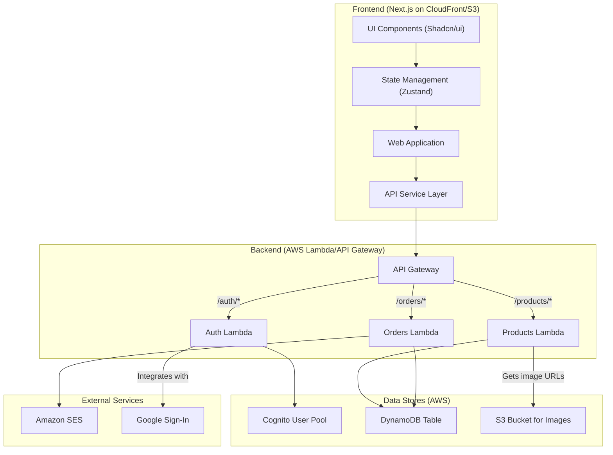

# Components

## Component Diagram

## Component List

### Frontend: Web Application
- **Responsibility:** Cung cấp giao diện người dùng, xử lý tương tác và hiển thị dữ liệu.
- **Key Interfaces:** Tương tác với `API Service Layer` để lấy và gửi dữ liệu.
- **Dependencies:** `API Service Layer`, `State Management`.
- **Technology Stack:** Next.js, React, TypeScript.

### Backend: Products Lambda
- **Responsibility:** Xử lý tất cả logic nghiệp vụ liên quan đến sản phẩm (lấy danh sách, chi tiết, tìm kiếm).
- **Key Interfaces:** Các endpoint API `/products` và `/products/{id}`.
- **Dependencies:** `DynamoDB`.
- **Technology Stack:** Node.js, TypeScript, Serverless Framework.

### Backend: Orders Lambda
- **Responsibility:** Xử lý logic tạo và quản lý đơn hàng, bao gồm cả quy trình thanh toán (giả định).
- **Key Interfaces:** Endpoint API `/orders`.
- **Dependencies:** `DynamoDB`, `Amazon SES` (để gửi email xác nhận).
- **Technology Stack:** Node.js, TypeScript, Serverless Framework.

### Backend: Auth Lambda
- **Responsibility:** Xử lý đăng ký, đăng nhập và các hoạt động liên quan đến xác thực người dùng.
- **Key Interfaces:** Các endpoint API `/auth/*`.
- **Dependencies:** `AWS Cognito`.
- **Technology Stack:** Node.js, TypeScript, Serverless Framework.
