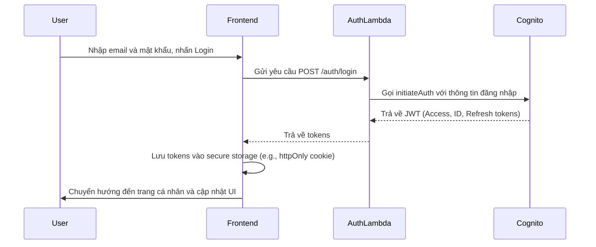
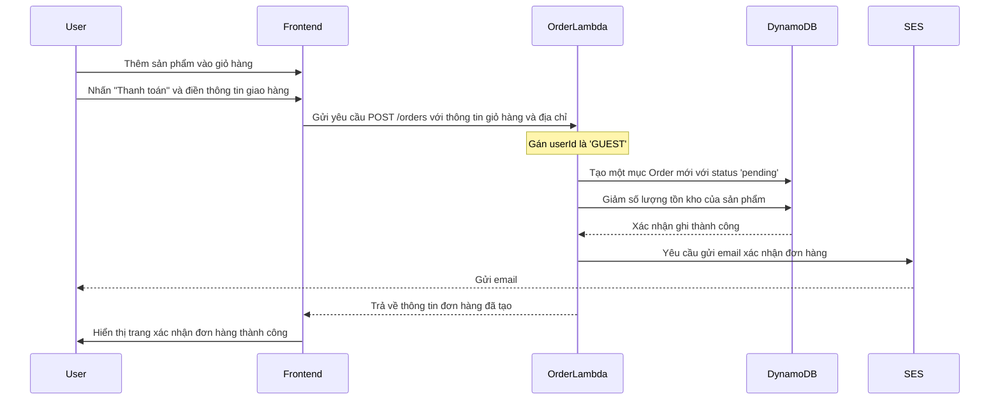

# Core Workflows

## User Authentication Flow (Login)

```mermaid
sequenceDiagram
    participant User
    participant Frontend
    participant AuthLambda
    participant Cognito

    User->>Frontend: Nhập email và mật khẩu, nhấn Login
    Frontend->>AuthLambda: Gửi yêu cầu POST /auth/login
    AuthLambda->>Cognito: Gọi initiateAuth với thông tin đăng nhập
    Cognito-->>AuthLambda: Trả về JWT (Access, ID, Refresh tokens)
    AuthLambda-->>Frontend: Trả về tokens
    Frontend->>Frontend: Lưu tokens vào secure storage (e.g., httpOnly cookie)
    Frontend->>User: Chuyển hướng đến trang cá nhân và cập nhật UI
```

## Guest Checkout Flow

```mermaid
sequenceDiagram
    participant User
    participant Frontend
    participant OrderLambda
    participant DynamoDB
    participant SES

    User->>Frontend: Thêm sản phẩm vào giỏ hàng
    User->>Frontend: Nhấn "Thanh toán" và điền thông tin giao hàng
    Frontend->>OrderLambda: Gửi yêu cầu POST /orders với thông tin giỏ hàng và địa chỉ
    Note over OrderLambda: Gán userId là 'GUEST'
    OrderLambda->>DynamoDB: Tạo một mục Order mới với status 'pending'
    OrderLambda->>DynamoDB: Giảm số lượng tồn kho của sản phẩm
    DynamoDB-->>OrderLambda: Xác nhận ghi thành công
    OrderLambda->>SES: Yêu cầu gửi email xác nhận đơn hàng
    SES-->>User: Gửi email
    OrderLambda-->>Frontend: Trả về thông tin đơn hàng đã tạo
    Frontend->>User: Hiển thị trang xác nhận đơn hàng thành công
```
