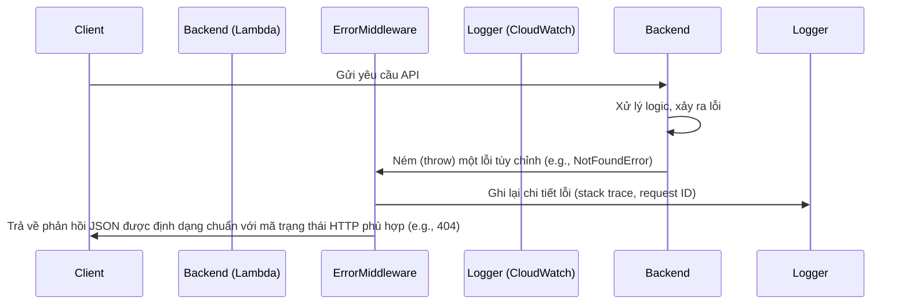

# Error Handling Strategy

## Error Flow


## Error Response Format
```typescript
interface ApiError {
  error: {
    code: string; // e.g., 'NOT_FOUND'
    message: string; // 'Product not found'
    details?: Record<string, any>;
    timestamp: string;
    requestId: string; // AWS Request ID
  };
}
```

## Frontend Error Handling
```typescript
// src/services/product-service.ts
import { toast } from 'sonner'; // Giả sử dùng thư viện toast

export const productService = {
  async getProductById(id: string): Promise<Product | null> {
    try {
      const response = await apiClient.get(`/products/${id}`);
      return response.data;
    } catch (error) {
      if (axios.isAxiosError(error) && error.response?.status === 404) {
        toast.error('Sản phẩm không tồn tại.');
      } else {
        toast.error('Đã có lỗi xảy ra.');
      }
      // Ghi log lỗi vào một dịch vụ giám sát (Sentry, LogRocket)
      console.error(error);
      return null;
    }
  },
};
```

## Backend Error Handling
```typescript
// src/core/error-middleware.ts (Conceptual)
// Đây là một middleware được áp dụng cho các handler, ví dụ sử dụng middy.js
import middy from '@middy/core';

const errorHandlerMiddleware = (): middy.MiddlewareObj => {
  const onError: middy.MiddlewareFn = async (request) => {
    const { error } = request;
    // Log error to CloudWatch
    console.error(error);

    // Default error
    let statusCode = 500;
    let message = 'Internal Server Error';
    let code = 'INTERNAL_ERROR';

    if (error.name === 'NotFoundError') {
      statusCode = 404;
      message = error.message;
      code = 'NOT_FOUND';
    }
    // ... other custom errors

    request.response = {
      statusCode,
      body: JSON.stringify({
        error: { code, message, timestamp: new Date().toISOString() }
      }),
    };
  };
  return { onError };
};
```
