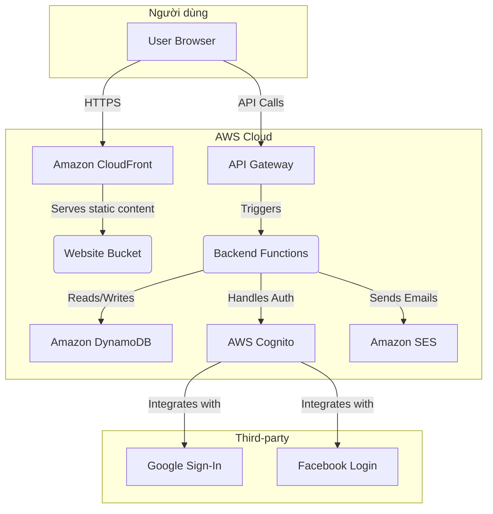

# **High Level Architecture**

## Technical Summary

Kiến trúc cho 18th Perfume được thiết kế theo phương pháp tiếp cận "serverless-first" và Jamstack, tận dụng các dịch vụ được quản lý của AWS để đạt được khả năng mở rộng, hiệu suất và chi phí vận hành thấp. Giao diện người dùng (frontend) sẽ là một ứng dụng Next.js được tạo tĩnh (statically-generated), cung cấp trải nghiệm người dùng nhanh chóng và được phân phối toàn cầu qua Amazon CloudFront. Phần phụ trợ (backend) sẽ được xây dựng trên AWS Lambda và API Gateway, cung cấp các API RESTful an toàn và có khả năng mở rộng. Tích hợp giữa hai phần sẽ thông qua các lệnh gọi API được định nghĩa rõ ràng, với AWS Cognito quản lý xác thực người dùng. Kiến trúc này trực tiếp giải quyết các yêu cầu trong PRD về hiệu suất, khả năng mở rộng linh hoạt và bảo mật mạnh mẽ.

## Platform and Infrastructure Choice

**Platform:** AWS (Amazon Web Services)
**Key Services:** AWS Lambda, API Gateway, Amazon S3, Amazon CloudFront, Amazon DynamoDB, AWS Cognito, Amazon SES.
**Deployment Host and Regions:** ap-southeast-1 (Singapore)

## Repository Structure

**Structure:** Polyrepo
**Monorepo Tool:** N/A
**Package Organization:**
Sẽ có hai kho lưu trữ (repository) riêng biệt:
1.  `18thperfume-frontend`: Chứa ứng dụng Next.js.
2.  `18thperfume-backend`: Chứa các dịch vụ backend serverless (AWS Lambda, Serverless Framework).

Lý do chọn Polyrepo là để cho phép các nhóm frontend và backend phát triển và triển khai độc lập, giảm độ phức tạp trong pipeline CI/CD cho từng phần.

## High Level Architecture Diagram

### Architectural Patterns

- **Serverless-First:** Ưu tiên sử dụng các dịch vụ serverless của AWS (Lambda, DynamoDB, S3) để giảm thiểu chi phí vận hành, tự động mở rộng và tập trung vào việc viết mã logic nghiệp vụ thay vì quản lý cơ sở hạ tầng.
- **Jamstack:** Frontend được xây dựng dưới dạng các tệp tĩnh (HTML, CSS, JS) được tạo sẵn và phân phối qua CDN. Các chức năng động được xử lý thông qua các API có thể tái sử dụng. Điều này mang lại hiệu suất cao, bảo mật tốt hơn và trải nghiệm phát triển mượt mà.
- **Polyrepo:** Tách biệt mã nguồn frontend và backend thành các kho lưu trữ riêng biệt để cho phép các nhóm phát triển và triển khai độc lập.
- **Single-Table Design (DynamoDB):** Sử dụng một bảng duy nhất trong DynamoDB để lưu trữ tất cả các loại thực thể dữ liệu, tối ưu hóa cho các truy vấn hiệu suất cao bằng cách giảm thiểu số lượng yêu cầu đọc/ghi.
- **API Gateway Pattern:** Sử dụng AWS API Gateway làm một cổng vào duy nhất cho tất cả các yêu cầu từ client, giúp tập trung hóa việc xác thực, giới hạn tốc độ (rate limiting) và giám sát.
- **Component-Based UI:** Xây dựng giao diện người dùng từ các thành phần React có thể tái sử dụng, độc lập và được quản lý bằng Storybook, giúp tăng tính nhất quán và khả năng bảo trì.
- **Infrastructure as Code (IaC):** Sử dụng Serverless Framework để định nghĩa và quản lý tài nguyên cơ sở hạ tầng backend, đảm bảo tính nhất quán giữa các môi trường và tự động hóa việc triển khai.
