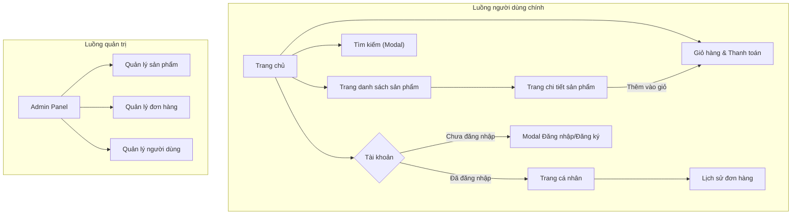
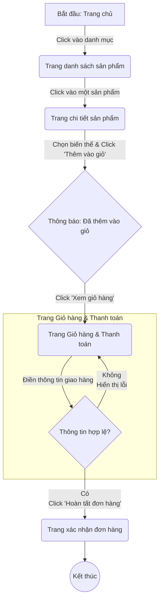

# Đặc tả UI/UX cho 18thPerfume

*   **Phiên bản:** 1.0
*   **Ngày:** 20/09/2025
*   **Tác giả:** Sally (UX Expert)

## Nhật ký thay đổi

| Ngày       | Phiên bản | Mô tả              | Tác giả             |
|------------|---------|--------------------------|--------------------|
| 20/09/2025 | 1.0     | Tạo bản nháp đầu tiên   | Sally (UX Expert)  |

---

## 1. Giới thiệu

Tài liệu này xác định các mục tiêu trải nghiệm người dùng, kiến trúc thông tin, luồng người dùng và các thông số kỹ thuật thiết kế trực quan cho giao diện người dùng của 18thPerfume. Nó đóng vai trò là nền tảng cho thiết kế trực quan và phát triển frontend, đảm bảo một trải nghiệm gắn kết và lấy người dùng làm trung tâm.

---

## 2. Mục tiêu & Nguyên tắc UX tổng thể

### 2.1. Chân dung Người dùng Mục tiêu

*   **Người dùng Mới (Casual User):** Những người mới tìm hiểu về nước hoa, ưu tiên sự dễ sử dụng và hướng dẫn rõ ràng.
*   **Người dùng Sành sỏi (Connoisseur):** Những người am hiểu về nước hoa, cần các công cụ lọc và tìm kiếm mạnh mẽ để khám phá sản phẩm chuyên sâu.
*   **Quản trị viên (Administrator):** Người quản lý hệ thống, cần các chức năng quản trị hiệu quả để quản lý sản phẩm, đơn hàng và người dùng.

### 2.2. Mục tiêu về Tính khả dụng

*   **Hiệu quả:** Người dùng có thể hoàn tất giao dịch mua hàng trong vòng dưới 2 phút.
*   **Dễ tìm kiếm:** Người dùng có thể dễ dàng tìm thấy sản phẩm họ muốn thông qua bộ lọc và tìm kiếm thông minh.
*   **Tin cậy:** Xây dựng sự tin tưởng và cảm giác an toàn cho người dùng khi thực hiện giao dịch.
*   **Hiệu suất:** Thời gian tải trang trung bình dưới 2 giây để mang lại trải nghiệm nhanh chóng.

### 2.3. Nguyên tắc Thiết kế

1.  **Sang trọng & Tối giản:** Giao diện sạch sẽ, tập trung vào hình ảnh sản phẩm chất lượng cao.
2.  **Nhanh chóng & Liền mạch:** Giảm thiểu các bước không cần thiết, đặc biệt trong quy trình thanh toán.
3.  **Rõ ràng & Trực quan:** Ưu tiên giao tiếp rõ ràng hơn là sự đổi mới phức tạp.
4.  **Phản hồi tức thì:** Mọi hành động của người dùng đều nhận được phản hồi rõ ràng và ngay lập tức.
5.  **Tiếp cận cho mọi người:** Thiết kế tuân thủ tiêu chuẩn WCAG AA để đảm bảo tất cả người dùng đều có thể truy cập.

---

## 3. Kiến trúc Thông tin (Information Architecture - IA)

### 3.1. Sơ đồ trang web (Site Map)

### 3.2. Cấu trúc Điều hướng (Navigation Structure)

*   **Điều hướng chính (Primary Navigation):** Thanh điều hướng ở đầu trang, chứa các danh mục sản phẩm chính, liên kết thương hiệu, và các biểu tượng cho Tìm kiếm, Tài khoản, và Giỏ hàng.
*   **Breadcrumbs:** Hiển thị trên các trang danh sách và chi tiết sản phẩm để người dùng dễ dàng xác định vị trí. Ví dụ: `Trang chủ > Nước hoa Nam > Dior Sauvage`.
*   **Điều hướng chân trang (Footer Navigation):** Chứa các liên kết tới các trang thông tin bổ sung (Về chúng tôi, Chính sách, v.v.).

---

## 4. Luồng người dùng & Kịch bản chính

### 4.1. Kịch bản 1: Khách hàng mới mua hàng (Guest Checkout Flow)

*   **Người dùng:** Một khách hàng lần đầu tiên truy cập trang web.
*   **Mục tiêu:** Tìm một sản phẩm, thêm vào giỏ hàng và hoàn tất việc mua hàng mà không cần tạo tài khoản.

---

## 5. Wireframes (Mô tả văn bản)

### 5.1. Wireframe: Trang danh sách sản phẩm

*   **Bố cục:** 2 cột. Cột trái (~25%) là bộ lọc chi tiết (giá, thương hiệu, giới tính, v.v.). Cột phải (~75%) là lưới sản phẩm.
*   **Lưới sản phẩm:** Hiển thị sản phẩm theo dạng lưới (5 sản phẩm/hàng). Nút "Xem thêm" ở cuối để tải thêm sản phẩm.
*   **Thẻ sản phẩm (Product Card):** Hiển thị hình ảnh, thương hiệu, tên sản phẩm, giá (của biến thể rẻ nhất), và các "swatches" (ô chọn nhỏ) để xem nhanh giá các dung tích khác nhau.

### 5.2. Wireframe: Trang chi tiết sản phẩm

*   **Bố cục:** 2 cột. Cột trái (~50%) là thư viện hình ảnh sản phẩm. Cột phải (~50%) là thông tin mua hàng.
*   **Thông tin mua hàng:** Tên thương hiệu, tên sản phẩm, giá (cập nhật động), các nút chọn biến thể (dung tích), ô chọn số lượng, và nút "Thêm vào giỏ hàng" nổi bật.
*   **Thông tin chi tiết:** Bên dưới là các tab "Mô tả", "Thông tin chi tiết" (nhóm hương, nồng độ, các tầng hương), và "Đánh giá".

### 5.3. Wireframe: Trang Giỏ hàng & Thanh toán hợp nhất

*   **Bố cục:** 2 cột. Cột trái (~60%) là nơi điền thông tin. Cột phải (~40%) là tóm tắt đơn hàng.
*   **Cột trái (Thông tin):** Biểu mẫu điền thông tin giao hàng (Họ tên, SĐT, Email, Địa chỉ) và phương thức thanh toán COD được chọn sẵn.
*   **Cột phải (Tóm tắt):** Danh sách sản phẩm trong giỏ (có thể sửa số lượng/xóa), tạm tính, phí vận chuyển, tổng cộng, và nút "Hoàn tất đơn hàng" lớn, rõ ràng. Cột này sẽ "dính" (sticky) khi cuộn trang.
